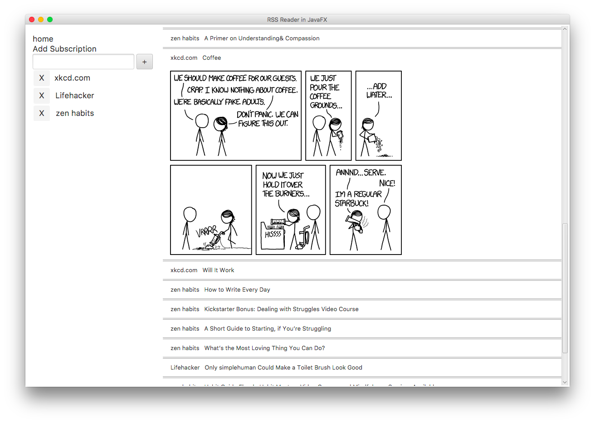

A Rss Reader implemented using JavaFX
=========

A small homage to the great days of Google's RSS reader. I used IntelliJ IDEA for this just to check it out. I found out that there is no File Import in this program. You have to copy files into it externally....

###Issue now

JavaFX's panel does not seem to adapt to the web content that is loaded in. Thus when scrolling in the pane, it entire window doesn't scroll down also like a normal RSS reader should.... I had to do a hacky thing...

